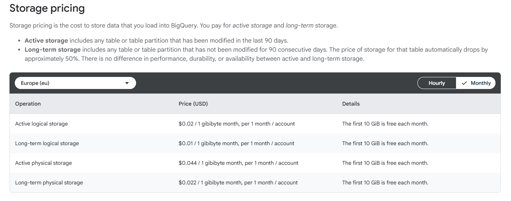

# Task 05 – BigQuery Storage Cost Estimate

**Assignment:**  
Estimate BigQuery data storage costs over five years for a company collecting 5 GB of data per day and keeping all historical data.

---

### Reference
Pricing information from Google Cloud BigQuery page:  
[https://cloud.google.com/bigquery/pricing#storage](https://cloud.google.com/bigquery/pricing#storage)

- **Active storage:** $0.02 per GB per month  
- **Long-term storage (after 90 days):** $0.01 per GB per month

---

### Calculation

- Daily data = 5 GB
- 5 years = 5 × 365 days = 1825 days  
- Total data after 5 years = 5 × 1825 = 9125 GB

| Category          | Size (GB)  | Price ($/GB/month) | Monthly Cost ($)      |
|-------------------|------------|--------------------|-----------------------|
| Active (90 days)  | 450        | 0.02               | 9.00                  |
| Long-term (older) | 8675       | 0.01               | 86.75                 |
| **Total**         | **9125**   | –                  | **95.75**             |

---

### Result
At steady-state after 5 years, the company will store about 9,1 TB of data,  
costing roughly $96 per month (~$1150 per year) for storage in BigQuery.

---

### Notes
- Costs exclude free 10 GB per month
- Long-term storage pricing applies automatically after 90 days
