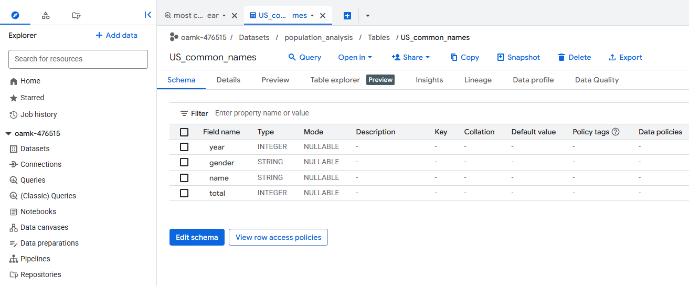
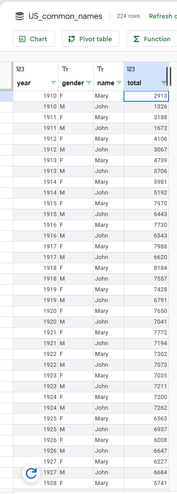

# Task 07 – Most Common US Names by Year

**Objective:**  
Find the most common male and female names for each year in the dataset  
`bigquery-public-data.usa_names.usa_1910_current`.

---

### Steps
1. Used a SQL query with RANK() to find the most frequent male and female names per year.
2. Executed the query through the BigQuery API, writing results directly to a new table.
3. The query runs fully inside BigQuery — no data was downloaded.

---

### Result
- Output table:  
  `oamk-476515.population_analysis.US_common_names`

#### Table Schema

#### Query Results Preview

---

### Verification
Both male (`M`) and female (`F`) records appear as expected for every year.