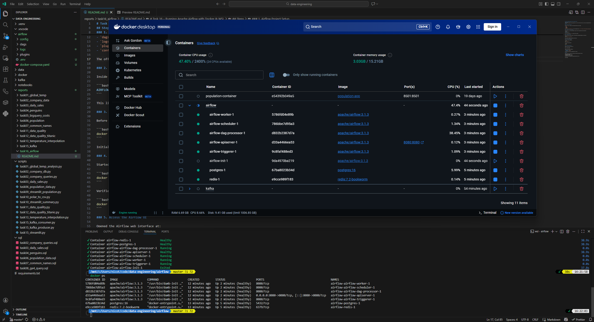

# Task 16 – Running Apache Airflow with Docker & WSL

**Objective:**  
Install and run Apache Airflow using Docker + WSL, start the Airflow services, and verify that example DAGs load successfully.

## Steps

### 1. Airflow Project Setup

Inside the `airflow/` folder, the following directories were created:

- `dags/`
- `logs/`
- `plugins/`
- `config/`

The official `docker-compose.yaml` file was downloaded using `curl -LfO 'https://airflow.apache.org/docs/apache-airflow/3.1.3/docker-compose.yaml'`.

### 2. Configure Airflow Environment

Inside WSL, an `.env` file was created to ensure correct file permissions inside containers:

```bash
AIRFLOW_UID=$(id -u)
```

This line was saved into `.env` inside the Airflow folder.

### 3. Initialize Airflow

Before starting the Airflow cluster, the environment and metadata database were initialized:

```bash
docker compose up airflow-init
```

Initialization completed successfully (exit code 0).

### 4. Start Airflow Services

Started all Airflow components:

```bash
docker compose up -d
```

Verified running containers:

```bash
docker ps
```



### 5. Access the Airflow UI

Opened the Airflow web interface at:

```
http://localhost:8080
```

Logged in with default credentials:

- **Username:** `airflow`
- **Password:** `airflow`

Confirmed that the built-in example DAGs were visible.

## Result

Apache Airflow was successfully installed and launched using Docker and WSL.

All services running  
Database initialized correctly  
Example DAGs visible in the UI  

Custom DAGs can now be added by placing Python DAG files into:
```
airflow/dags/
```