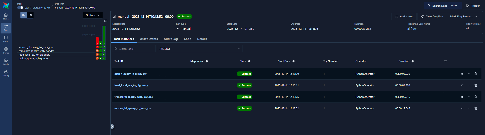

# Exercise 17 – Airflow ETL & ELT Pipeline with BigQuery

**Objective:**  

This exercise implements an end-to-end ETL and ELT data pipeline using Apache Airflow and Google BigQuery.

The pipeline extracts public data from BigQuery to local storage, transforms the data locally using Python and pandas, loads the transformed data back into BigQuery, and finally performs an action query entirely inside BigQuery.

The purpose of the exercise is to demonstrate workflow orchestration, cloud data warehouse usage, and the separation of ETL and ELT responsibilities.

---

### Data Source

**Public BigQuery dataset used in this exercise**: bigquery-public-data.usa_names.usa_1910_current

The dataset contains yearly counts of baby names in the USA and only data from 2000 to 2020 is processed.

---

### Pipeline

The pipeline is implemented as an Apache Airflow DAG named **task17_bigquery_etl_elt**.

The tasks are executed in the following order:
- extract_bigquery_to_local_csv
- transform_locally_with_pandas
- load_local_csv_to_bigquery
- action_query_in_bigquery

Each task is independent, observable, and retryable through the Airflow UI.

---

### Local Outputs

Pipeline-generated data files are written to the project data directory.

**Output location**: data/task17_bigquery_etl_elt/

**Files generated**: task17_usa_names_raw.csv

**Raw data extracted from BigQuery**: task17_usa_names_top20.csv

Locally transformed dataset containing the top 20 most common names per year and gender.

---

### BigQuery Outputs

The pipeline creates the following table in BigQuery:
- **de_course17_us.names_top20_local** that contains the locally transformed data loaded back into BigQuery

- **de_course17_us.names_yearly_gender_summary** which is created using a BigQuery action query. The table aggregates data by year and gender and includes summary statistics.

---

### Status

The pipeline executes successfully.

All Airflow tasks complete without errors.

Local outputs and BigQuery tables have been verified.

