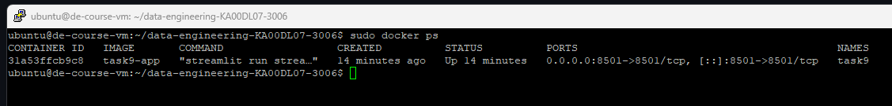
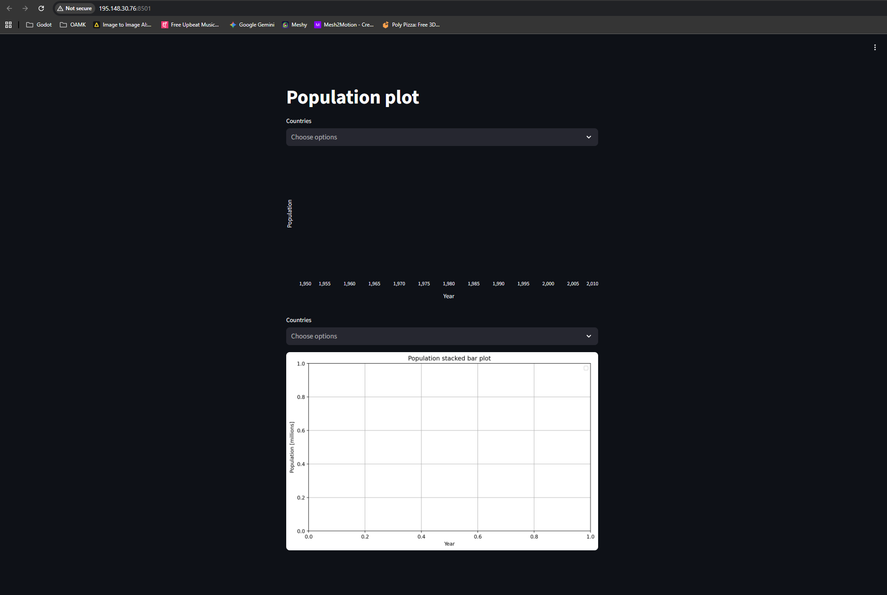

# Exercise 18 – CSC VM and Docker Deployment

**Objective:**  

This exercise demonstrates deploying a containerized data application on a cloud VM using CSC cPouta.

The goal was to create an Ubuntu virtual machine, install Docker, build a Docker image from a previously implemented course task 9, run the container on the VM and make the application accessible from a local machine by configuring network security rules.

---

### Cloud environment

Cloud provider used in this exercise: CSC cPouta

An Ubuntu virtual machine was created in CSC cPouta and accessed via SSH using key-based authentication.

---

### Application

The deployed application is based on the Dockerfile from Task 9.

The application is a Streamlit-based data visualization that displays population data and allows interactive selection of countries.

---

### Deployment

The deployment process consists of the following steps:
- Creating an Ubuntu virtual machine in CSC cPouta
- Installing Docker on the virtual machine
- Building a Docker image using the Task 9 Dockerfile
- Running the container with port mapping enabled
- Configuring CSC security group rules to allow inbound traffic from the local machine

The container is executed with port mapping 8501:8501.

---

### Network configuration

Inbound TCP traffic on port 8501 is allowed in the CSC security group.

Access is restricted to the local machine’s public IP address using a /32 CIDR rule.

---

### Verification

The deployment was verified by:

- Checking that the Docker container is running using docker ps

- Accessing the Streamlit application from a local web browser via the VM’s floating IP and port 8501

Application URL: http://195.148.30.76:8501

---

### Status

The application is running successfully and the Docker container is active and reachable from the local machine.
